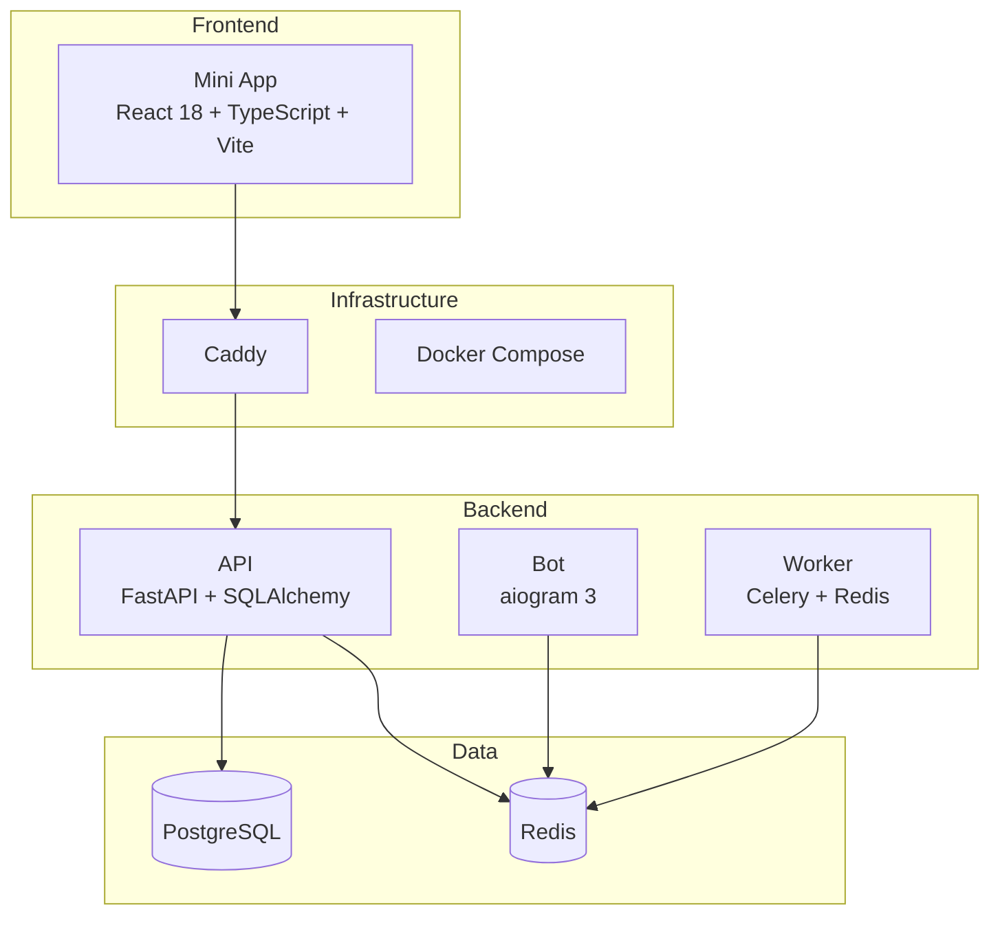

# Pepe

Telegram Mini App для рыночной аналитики криптовалют и золота.

## Статус

**Этап 1 — Technical foundation** — completed and merged.

**Этап 2 — Telegram Mini App `initData` validation** — completed and merged.

**Этап 3 — Telegram users persistence** — completed and merged.

**Этап 4 — Sessions and API authorization** — planning, blocked pending contract approval. Not implemented.

**Прогресс:** completed 3/12, remaining 9/12, progress by stages 25%.

## Дорожная карта

1. Technical foundation — completed and merged.
2. Telegram Mini App `initData` validation — completed and merged.
3. Telegram users persistence — completed and merged.
4. Sessions and API authorization — planning; blocked pending contract approval; not implemented.
5. Asset catalog and market provider abstraction — not started.
6. Current quotes — not started.
7. Candles and historical data — not started.
8. Real market UI — not started.
9. Analytics core — not started.
10. Reports and publishing — not started.
11. AI Support and notifications — not started.
12. Production hardening and launch — not started.

Официальный proposed Stage 4 document: [docs/architecture/stage-4-sessions-api-authorization.md](docs/architecture/stage-4-sessions-api-authorization.md). Реализация запрещена до явного утверждения контракта пользователем.

## Контекст будущих этапов (не реализовано)

- **Stage 5:** asset catalog; BTC, ETH, XAU/USD; provider abstraction; разные правила ликвидности для crypto, metals, indices и yields.
- **Stage 6:** current quotes; cache; timestamps; stale handling; provider failover.
- **Stage 7:** OHLCV и historical candles с достаточным indicator warm-up: D1 — 250, H4 — 300, H1 — 300, M15 — 200.
- **Stage 8:** real market UI с реальными данными и состояниями loading, stale, unavailable, error.
- **Stage 9:** Swing High / Swing Low, EMA, ATR, RSI, volume, FVG, sessions, BTC context, Trend Score и матрица триады. До реализации требуется формализовать Trend Score/веса/пороги, матрицу триады, FVG formulas/mitigation, session timezone/DST; BTC context применим только к crypto, а XAU/USD, indices и yields требуют отдельной логики.
- **Stage 10:** reports, publishing, history и безопасный аналитический язык.
- **Stage 11:** AI explanation, notifications, preferences, rate limits и отсутствие финансовых обещаний.
- **Stage 12:** security hardening, observability, backups, production migrations, secrets management, performance, rate limiting, deployment и launch checklist.

## Реализованная граница Этапа 3

На этом этапе реализованы серверная проверка Telegram initData и создание/обновление Telegram-пользователей. **Не реализовано**:

- Авторизация пользователей (sessions, JWT, tokens)
- Рыночные интеграции (Binance, OKX, CoinGecko, Gold API)
- Определение тренда и FVG
- Торговая аналитика
- Расписания и планировщики
- Публикация аналитических сводок
- AI API и чат
- Платежи и заказы
- Портфель и отслеживание активов

## Стек



## Требования

- Docker и Docker Compose
- Node.js 20+ (для локальной разработки)
- Python 3.12+ (для локальной разработки)

## Настройка

1. Клонируйте репозиторий:

```bash
git clone https://github.com/Deko-sudo/pepe.git
cd pepe
```

2. Скопируйте переменные окружения:

```bash
cp .env.example .env
```

3. Отредактируйте `.env` при необходимости.

### Порты

Все внешние порты параметризуются через переменные окружения в `.env`:

| Переменная | По умолчанию | Описание |
|---|---|---|
| `MINI_APP_PORT` | `4000` | Mini App (Nginx) |
| `API_EXT_PORT` | `8100` | FastAPI |
| `POSTGRES_PORT` | `5433` | PostgreSQL |
| `REDIS_PORT` | `6380` | Redis |
| `CADDY_PORT` | `8080` | Caddy reverse proxy |

## Запуск

### Docker Compose (рекомендуется)

```bash
make up
```

Или:

```bash
docker compose up -d
```

### Локальная разработка

#### Frontend

```bash
cd apps/mini-app
npm install
npm run dev
```

#### Backend API

```bash
cd apps/api
pip install -e ".[dev]"
uvicorn app.main:app --reload
```

#### Bot

```bash
cd apps/bot
pip install -e ".[dev]"
python -m app.main
```

#### Worker

```bash
cd apps/worker
pip install -e ".[dev]"
celery -A app.celery_app worker
```

## Makefile

```bash
make help       # Показать доступные команды
make up         # Запустить все сервисы
make down       # Остановить все сервисы
make build      # Собрать все образы
make test       # Запустить все тесты
make lint       # Запустить линтеры
make typecheck  # Запустить проверку типов
make migrate    # Применить миграции
```

## Локальные URL

| Сервис | URL |
|---|---|
| Mini App | http://localhost:${MINI_APP_PORT:-4000} |
| API | http://localhost:${API_EXT_PORT:-8100} |
| API Docs | http://localhost:${API_EXT_PORT:-8100}/docs |
| PostgreSQL | localhost:${POSTGRES_PORT:-5433} |
| Redis | localhost:${REDIS_PORT:-6380} |
| Caddy | http://localhost:${CADDY_PORT:-8080} |

## Миграции

```bash
make migrate
```

Или вручную:

```bash
cd apps/api
alembic upgrade head
```

## Тесты

```bash
make test
```

Или по сервисам:

```bash
# Frontend
cd apps/mini-app && npm test

# API
cd apps/api && pytest

# Bot
cd apps/bot && pytest

# Worker
cd apps/worker && pytest
```

## Структура монорепозитория

```
pepe/
├── apps/
│   ├── mini-app/      # Telegram Mini App (React)
│   ├── api/           # Backend API (FastAPI)
│   ├── bot/           # Telegram Bot (aiogram)
│   └── worker/        # Background Worker (Celery)
├── packages/
│   ├── api-contracts/ # API контракты
│   ├── design-tokens/ # Дизайн-токены
│   └── shared-config/ # Общая конфигурация
├── infrastructure/
│   ├── caddy/         # Caddy конфигурация
│   ├── docker/        # Docker файлы
│   └── cloudflare/    # Cloudflare документация
├── docs/
│   ├── architecture/  # Архитектурные решения
│   ├── product/       # Продуктовая документация
│   ├── security/      # Безопасность
│   └── trading/       # Торговая логика
├── scripts/           # Утилиты
├── tests/             # Интеграционные тесты
├── .github/workflows/ # CI/CD
├── .env.example       # Пример переменных
├── docker-compose.yml # Docker Compose
├── Makefile           # Команды
└── README.md          # Документация
```

## Mini App

Telegram Mini App с страницами:

- `/` — Dashboard
- `/markets` — Рынки
- `/reports` — Сводки
- `/settings` — Настройки

Дизайн: тёмный AI/Web3 интерфейс с фиолетово-голубыми градиентами.

## API

FastAPI сервис с эндпоинтами:

- `GET /api/v1/health` — Проверка здоровья
- `GET /api/v1/ready` — Проверка зависимостей (200 OK / 503 Service Unavailable)
- `GET /api/v1/version` — Информация о версии
- `POST /api/v1/auth/telegram/validate` — Проверка Telegram initData
- `POST /api/v1/users/me` — Профиль пользователя из проверенного Telegram initData

## Bot

Telegram бот с командами:

- `/start` — Запуск приложения
- `/help` — Справка

## Worker

Celery воркер с задачами:

- `heartbeat` — Проверка работоспособности
- `test_task` — Тестовая задача

## Cloudflare

Документация по деплою через Cloudflare: `infrastructure/cloudflare/README.md`

## Troubleshooting

### Контейнер не запускается

Проверьте логи:

```bash
docker compose logs <service>
```

### PostgreSQL не доступен

Убедитесь, что PostgreSQL запущен и здоров:

```bash
docker compose ps postgres
```

### Redis не доступен

Проверьте подключение:

```bash
docker compose exec redis redis-cli ping
```

## Ограничения

- Все данные на Dashboard являются демонстрационными
- Нет реальных рыночных интеграций
- Нет полноценной авторизации (профиль доступен только по повторно проверенному initData)
- Нет сессий, JWT, refresh tokens

## Telegram initData Validation

Backend проверяет подлинность `Telegram.WebApp.initData` через HMAC-SHA-256:

1. Фронтенд получает `initData` из Telegram WebView
2. Отправляет строку на `POST /api/v1/auth/telegram/validate`
3. Backend вычисляет HMAC-SHA-256 и сравнивает с полученным hash
4. Проверяет срок действия `auth_date` (по умолчанию 1 час)
5. Возвращает нормализованные данные пользователя

**Важно:** `initDataUnsafe` не используется как доверенный источник.

### Environment Variables

```
TELEGRAM_BOT_TOKEN=           # Токен бота (обязателен для проверки)
TELEGRAM_INIT_DATA_MAX_AGE_SECONDS=3600
TELEGRAM_INIT_DATA_FUTURE_SKEW_SECONDS=30
```

При пустом `TELEGRAM_BOT_TOKEN` endpoint возвращает 503.

## Реализовано на Этапе 3

- Таблица пользователей
- Создание/обновление пользователя после проверки
- Endpoint `POST /users/me`
- Alembic migration
