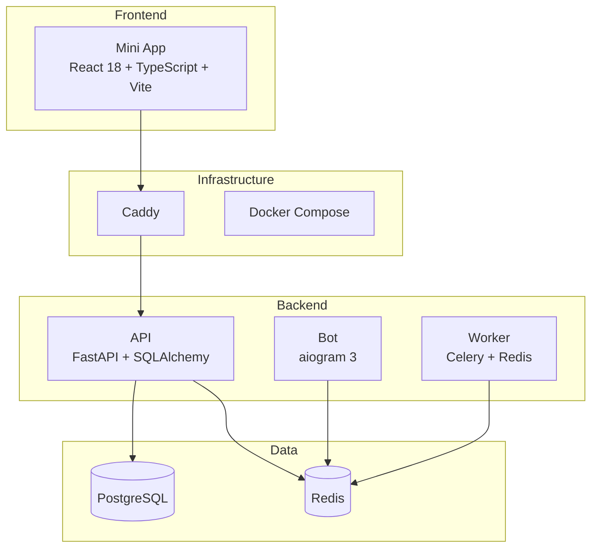

# Pepe

Telegram Mini App для рыночной аналитики криптовалют и золота.

## Статус

**Этап 1** — Технический фундамент.

Статус: 🔄 В разработке

## Границы этапа

На этом этапе реализован только технический фундамент. **Не реализовано**:

- Telegram initData валидация
- Авторизация пользователей
- Рыночные интеграции (Binance, OKX, CoinGecko, Gold API)
- Определение тренда и FVG
- Торговая аналитика
- Расписания и планировщики
- Публикация аналитических сводок
- AI API и чат
- Платежи и заказы
- Портфель и отслеживание активов

## Стек



## Требования

- Docker и Docker Compose
- Node.js 20+ (для локальной разработки)
- Python 3.12+ (для локальной разработки)

## Настройка

1. Клонируйте репозиторий:

```bash
git clone https://github.com/Deko-sudo/pepe.git
cd pepe
```

2. Скопируйте переменные окружения:

```bash
cp .env.example .env
```

3. Отредактируйте `.env` при необходимости.

## Запуск

### Docker Compose (рекомендуется)

```bash
make up
```

Или:

```bash
docker compose up -d
```

### Локальная разработка

#### Frontend

```bash
cd apps/mini-app
npm install
npm run dev
```

#### Backend API

```bash
cd apps/api
pip install -e ".[dev]"
uvicorn app.main:app --reload
```

#### Bot

```bash
cd apps/bot
pip install -e ".[dev]"
python -m app.main
```

#### Worker

```bash
cd apps/worker
pip install -e ".[dev]"
celery -A app.celery_app worker
```

## Makefile

```bash
make help       # Показать доступные команды
make up         # Запустить все сервисы
make down       # Остановить все сервисы
make build      # Собрать все образы
make test       # Запустить все тесты
make lint       # Запустить линтеры
make typecheck  # Запустить проверку типов
make migrate    # Применить миграции
```

## Локальные URL

| Сервис | URL |
|---|---|
| Mini App | http://localhost:3000 |
| API | http://localhost:8000 |
| API Docs | http://localhost:8000/docs |
| PostgreSQL | localhost:5432 |
| Redis | localhost:6379 |
| Caddy | http://localhost |

## Миграции

```bash
make migrate
```

Или вручную:

```bash
cd apps/api
alembic upgrade head
```

## Тесты

```bash
make test
```

Или по сервисам:

```bash
# Frontend
cd apps/mini-app && npm test

# API
cd apps/api && pytest

# Bot
cd apps/bot && pytest

# Worker
cd apps/worker && pytest
```

## Структура монорепозитория

```
pepe/
├── apps/
│   ├── mini-app/      # Telegram Mini App (React)
│   ├── api/           # Backend API (FastAPI)
│   ├── bot/           # Telegram Bot (aiogram)
│   └── worker/        # Background Worker (Celery)
├── packages/
│   ├── api-contracts/ # API контракты
│   ├── design-tokens/ # Дизайн-токены
│   └── shared-config/ # Общая конфигурация
├── infrastructure/
│   ├── caddy/         # Caddy конфигурация
│   ├── docker/        # Docker файлы
│   └── cloudflare/    # Cloudflare документация
├── docs/
│   ├── architecture/  # Архитектурные решения
│   ├── product/       # Продуктовая документация
│   ├── security/      # Безопасность
│   └── trading/       # Торговая логика
├── scripts/           # Утилиты
├── tests/             # Интеграционные тесты
├── .github/workflows/ # CI/CD
├── .env.example       # Пример переменных
├── docker-compose.yml # Docker Compose
├── Makefile           # Команды
└── README.md          # Документация
```

## Mini App

Telegram Mini App с страницами:

- `/` — Dashboard
- `/markets` — Рынки
- `/reports` — Сводки
- `/settings` — Настройки

Дизайн: тёмный AI/Web3 интерфейс с фиолетово-голубыми градиентами.

## API

FastAPI сервис с эндпоинтами:

- `GET /api/v1/health` — Проверка здоровья
- `GET /api/v1/ready` — Проверка зависимостей
- `GET /api/v1/version` — Информация о версии

## Bot

Telegram бот с командами:

- `/start` — Запуск приложения
- `/help` — Справка

## Worker

Celery воркер с задачами:

- `heartbeat` — Проверка работоспособности
- `test_task` — Тестовая задача

## Cloudflare

Документация по деплою через Cloudflare: `infrastructure/cloudflare/README.md`

## Troubleshooting

### Контейнер не запускается

Проверьте логи:

```bash
docker compose logs <service>
```

### PostgreSQL не доступен

Убедитесь, что PostgreSQL запущен и здоров:

```bash
docker compose ps postgres
```

### Redis не доступен

Проверьте подключение:

```bash
docker compose exec redis redis-cli ping
```

## Ограничения

- Все данные на Dashboard являются демонстрационными
- Нет реальных рыночных интеграций
- Нет авторизации пользователей
- Нет валидации Telegram initData

## Следующий этап

- Telegram initData аутентификация
- HMAC-SHA256 валидация
- Сессии пользователей
- Начальные бизнес-сущности базы данных
